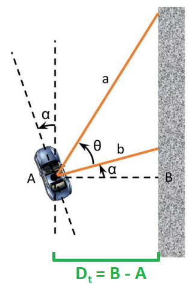

# F1TENTH LAB study repo

## 해당 REPO를 만든 이유

- 팀원이 이미 진행한 코드가 존재, 하지만 **f1tenth lab**을 봤을 때, 해당 코드를 직접 작성하는 방식임을 몰랐음
- 그저 그냥 해당 코드에 대한 설명만 있고, 실행을 해보는 시간으로 착각함
- 이를 lab7을 진행할 때 **assignment**라는 것이 존재하고, 이로 인해 점수가 존재함을 확인함
- 그래서 이미 아는 내용이어도 해당 레포에 clone을 하여 진행하는 것으로 결정

## LAB1

**LAB1은 ROS2에 대한 기본 지식에 대해 알아보는 시간이다**

### 목표

- 목표로는 ROS2에 익숙해지고, 어떤 식으로 **publisher**와 **subscriber** node를 생성하는 지 이해하는 시간이다
- ROS2의 패키지 구조, 파일, 의존성들에 대해서 이해하는 시간이다
- launch 파일을 생성해보는 시간이다

### ROS2 기본

- ROS2 사용을 위한 명령

```bash
source /opt/ros/foxy/setup.bash
```

해당 명령을 **terminal**에 입력을 하면 ROS2 명령어를 사용할 수 있게
됨

- 기본 명령어

```bash
ros2 topic list
```

을 통해 **topic list**를 볼 수 있는데, 기본적으로 아래 두 개의 토픽을 볼 수 있음

```bash
/parameter_events
/rosout
```

### Package 생성

- ROS2 패키지는 'Python'과 'C++' 둘 다 지원함
- 이 때 패키지를 생성할 때 패키지 이름뿐만 아니라 build type을 지정할 수도 있고, 의존성도 지정할 수 있음
- 주로 'C++'로 이용할 것이기 때문에 **build type**은 'CMake'로 지정
- 패키지 이름은 'lab1_pkg'로 생성
- 의존성과 관련된 부분은 'package.xml'에서 선언이 가능하며, build type 또한 'package.xml'에서 변경 가능함
- 해당 패키지는 의존성으로 'ackermann_msgs'를 필요로 함
- 여기까지 수행과정은

```bash
ros2 pkg create lab1_pkg
or
ros2 pkg create --build-type ament_cmake lab1_pkg
or
ros2 pkg create --build-type amnet_python lab1_pkg
or
ros2 pkg create --build-type ament_cmake lab1_pkg --dependencies ackermann_msgs
```

첫번째는 기본적인 패키지 생성 방법이고, **build type**은 기본적으로 **cmake**이며 의존성도 선언되어 있지 않음
두번째는 **build type**을 **cmake**로 지정해주는 것이고, 이도 동일하게 의존성은 선언되어 있지 않음
세번째는 **build type**을 **python**으로 지정해주는 것이고, 이도 동일하게 의존성은 선언되어 있지 않음
네번째는 **build type**을 **cmake**으로 지정해주고, 의존성에 **ackermann_msgs**를 선언해줌

- 결론적으로 네번째 방식을 사용을 하면 요구사항을 'package.xml'에서 추가를 안해줘도 됨
- 'package.xml'에서 충분히 수정 가능하니 첫번째 방식을 사용하거나 오타가 나도 무방함
- 선언한 의존성이 설치될 수 있도록 'rosdep' 명령어를 사용

```bash
rosdep install --from-paths src --ignore-src -r -y
```

- 패키지 내부에는 중복된 'src' 폴더나 불필요한 'install'이나 'build'가 없어야 함

### Publisher와 Subscriber 노드 생성

- 언어는 'C++' 또는 'Python' 중 원하는 것으로 작성하기
- 여기서는 'C++' 로 먼저 작성

- **첫번째 노드**
- 'talker.cpp' 또는 'talker.py'로 작성
- 'talker'는 'v'와 'd' 두 개의 ROS 파라미터 수신
- 'talker'는 'speed' 필드와 'v' 파라미터가 같고, 'steering_angle' 필드와 'd' 파라미터가 같은 'AckermannDriveStamped' 메시지를 'drive'라는 이름의 토픽으로 **publish**

- **두번째 노드**
- 'relay.cpp' 또는 'relay.py'로 작성
- 'relay'는 'drive' 토픽을 **subscribe**
- 받은 메시지인 'speed'와 'steering_angle'을 3배 해서 'AckermannDriveStamped' 메시지를 'drive_relay'라는 이름의 토픽으로 **publish**

### Launch 파일 생성

- 위에서 작성한 **publisher**와 **subscriber**를 확인하기 위해서 launch 파일을 작성해야 함
- launch 파일 툴을 보고 그대로 작성하였으나 실패 -> 공부가 부족했다는 증거
- launch폴더를 인식하기 위해서 CMakeLists.txt에서 install 경로에 launch 폴더를 추가하여 인식할 수 있도록 해야 함 (단, ament_package() 위에)

```txt
# Install launch files.
install(DIRECTORY
  launch
  DESTINATION share/${PROJECT_NAME}/
)
```

- 그 결과 launch 파일 정상 인식 후, 실행까지 가능. 하지만 여기서 다양한 에러 발생. 에러 분석 후 수정
- 이번에는 실행을 하고자 하는 node들을 인식하지 못하는 것에 대한 문제가 발생함.
- 이도 launch를 인식할 수 있도록 작성한 **cpp** 코드를 인식 할 수 있도록 해야함

```txt
# Include directories
include_directories(include)

# Add executables
add_executable(talker src/talker.cpp)
ament_target_dependencies(talker rclcpp ackermann_msgs)

add_executable(relay src/relay.cpp)
ament_target_dependencies(relay rclcpp ackermann_msgs)

# Install executables
install(TARGETS
  talker
  relay
  DESTINATION lib/${PROJECT_NAME})
```

- 그 결과 정상 작동함을 알 수 있음

### LAB1 결론

- 주의해야할 점이 존재
- 기존에 무작정 있는 코드를 작성하니 뭐가 필요한 지 잘 몰랐음
- install에 정상적으로 설치가 되어야 **ROS**에서 인식할 수 있으므로, 이와 관련 된 부분을 특히 주의해야함
- install구문을 CMakeLists.txt에 추가하는 법을 까먹을 시 **'Launch 파일 생성'** 부분을 다시 볼 것
- 2024/7/20 기준으로 아직 **python**에 관한 것은 작성안함

### ROS 2 커맨드

- 알아두면 쓸 일이 있는 ROS2 커맨드 topic과 node가 정상적으로 작동하고 송수신 하는 지 확인할 때 주로 사용

```bash
ros2 topic list
ros2 topic info drive
ros2 topic echo drive
ros2 node list
ros2 node info talker
ros2 node info relay
```

### 패키지 구성

- 패키지 구성

```txt
- package.xml (패키지 설정 파일)
- CMakeLists.txt (빌드 설정 파일)
- setup.py (파이썬 패키지 설정 파일)
- setup.cfg (파이썬 패키지 환경 설정 파일)
- plugin.xml (RQt 플러그인 설정 파일)
- CHANGELOG.rst( 패키지 변경로그 파일)
- LICENSE (라이선스 파일)
- README.md (패키지 설명 파일)
```

## LAB2

### LAB2 목표 및 개요

- LAB2에서는 **LaserScan** 메시지를 이용해서 iTTC를 계산하여 치명적인 시스템 결함에서 안전하게 하는 것을 구현하는 것
- ROS2가 ROS1이랑 유사는 하지만

```bash
ros2 interface show <msg_name>
```

으로 메시지의 정의를 볼 수 있음

- 만약 설치되어있지않으면 설치를 먼저 할 것

### 사용되는 메세지

#### 'LaserScan' 메시지

- 유용한 field가 포함되어 있음
- 여기서 가장 많이 사용할 필드는 'ranges'
- 'ranges'는 방사형으로 정렬된 LiDAR의 모든 측정값을 포함하는 배열
- 이 메시지를 통해 '/scan'토픽을 subscribe 해야함

#### 'Odometry' 메시지

- cars positioon, orientation, velocity 와 같은 몇가지 field를 모함하고 있는 메시지
- 이번 LAB에서 이 메시지 유형을 조사해야함

#### 'AckermannDriveStamped' 메시지

- 이미 사용했던 메시지
- 시뮬레이터나 차량을 동작시킬 때 사용함
- 'speed' field를 0.0으로 설정해서 해당 메시지를 전송하면 차량이 멈춤

### TTC 계산

- Time to Collision(TTC)는 자동차가 현재의 방향과 속도를 유지한다면 장애물과 충돌하는 데 걸리는 시간을 의미
- 우리는 차량의 현재 범위 측정과 속도 측정에서 계산된 순간 범위 대 범위 비율인 iTTC를 사용하여 충돌까지의 시간을 근사화
- 계산 식은 아래와 같음
  $$ iTTC=\frac{r}{\lbrace- \dot{r}\rbrace\_{+}} $$
- $r$는 순간 범위 측정이고 $\dot{r}$는 해당 측정의 현재 범위 속도
- 연산자 $\lbrace \rbrace_{+}$는 $\lbrace x\rbrace_{+} = \text{max}(x, 0)$로 정의
- 장애물에 대한 순간 범위 $r$는 'LaserScan' 메시지의 전류 측정값을 사용
- 범위 비율 $\dot{r}$은 각 스캔 빔을 따라 예상되는 변화율, 양의 범위 비율은 범위 측정이 확장 중임을 의미, 음의 range rate는 범위 측정이 축소 중임을 의미

**계산방식**

1. $v_x \cos{\theta_{i}}$를 사용하여 각 스캔 빔의 각도에 차량의 현재 종방향 속도를 매핑하여 계산가능. range rate를 양이나 음의 값 할당에 주의. 각도는 'LaserScan' 메시지의 정보에 따라 결정가능, 차량이 현재 속도를 유지하고 장애물이 유지할 경우 측정값이 얼마나 변하는 지를 나타내는 것으로 해석 가능
2. 이전 범위 측정과 현재의 차이를 취하여 그 사이에 시간이 얼마나 흘렀는지를 나누고 범위 비율을 계산할 수 있음 (timestamp는 메시지 헤더에 사용 가능)

**계산 시 주의할 점**
계산에서 negation은 범위 측정이 감소해야하는 지 증가해야하는 지를 올바르게 해석하기 위한 것. 장애물을 향해 전방으로 이동하는 차량의 경우 범위 측정이 축소되어야 하므로 차량 바로 앞에 있는 beam의 range rate는 음수여야 함. 그 반대의 경우 범위 측정이 증가해야 하므로 장애물에서 멀리 이동하는 차량의 range rate는 양수여야 함. operator가 제자리에 있으므로 iTTC계산은 의미가 있는 것임. range rate가 양수가 되면 operator는 그 각도에 대한 iTTC가 무한대로 가는 지 확인해야 함.

**계산이 끝난 후**
계산을 마친 후에는 각 각도에 해당하는 iTTC의 배열로 끝나야 함. 충돌까지의 시간이 특정 임계값(threshold) 아래오 떨어지면 충돌이 임박했음을 의미

### iTTC를 이용한 Automatic Emergency Braking

- ROS2 노드로 'LaserScan'과 'Odometry'를 subscribe
- 필요하다면 speed field를 0.0으로 설정을 해서 브레이크 동작을 함께 'AckermannDriveStamped' 메시지를 publish
- 이후 iTTC의 배열을 계산해야하고, 이 정보를 어떻게 처리할 지 정해야함
- 어떻게 임계값을 결정하고, 충돌이 임박하지 않은 경우 브레이크를 밟는 가장 좋은 방법을 결정해야함
- 배열에 포함된 'inf'나 'nan'도 처리해야함 (무한이나 공백)

- 테스트를 위해서는 simulation환경이니 simulation이 true로 되어 있는 것들로 테스트를 하고, 키보드로 조작하는 코드도 실행시켜 주행 중 위험에 대비할 것
- subscriber와 publisher로 사용할 각 메시지의 노드는

```txt
- 'LaserSacn': /scan
- 'Odometry': /ego_racevar/odom, 구체적으로 차량의 종방향 속도는 'twist.twist.linear.x'에서 확인가능
- 'AckermannDriveStamped': /drive
```

### 구현해보기

- 시뮬레이션 환경은 f1tenth_gym_ros에서 가져와서 활용
- 해당 파일에서 수정해야할 사항 config/sim.yaml에서 맵을 읽어오는 디렉토리 수정
- ROS2를 구동하는 환경에서 f1tenth에서 제공해주는 f1tenth_gym git clone해서 gym 이용에 도움을 주는 라이브러리 설치

```bash
cd ~/
git clone https://github.com/f1tenth/f1tenth_gym
cd ~/f1tenth_gym && pip3 install -e .
```

- 그 후 시뮬레이션 환경 실행해보기

```bash
cd ~/f1tenth_labs/
ros2 launch f1tenth_gym_ros gym_bridge_launch.py
```

하면 시뮬레이션 정상적으로 구성 완료함을 알 수 있음

- 근데 깃허브 공부도 착실히 해야할 듯. github에서도 지우고 local에서도 지우고 하면서 동시에 pull/push를 했더니 꼬임 주의할 것
- 시뮬레이션 구성을 완료하였으니 위에서 확인한 topic을 이용하여 subscribe와 publish하는 것을 safety_node에 작성
- sensor msgs의 대부분의 변수타입 float, std::vector<float>..
- iTTC 계산 방법
- 각 레이저 빔에 대해 distance (현재 거리)와 relative_velocity (상대 속도)를 계산
- angle_min은 첫번째 각도, 그 이후 증가한만큼 더해서 각 라이다 range 배열의 데이터마다의 각도 계산을 함 => angle
- relative_velocity가 음수인 경우(즉, 두 물체가 가까워질 경우)에만 iTTC를 계산
- iTTC가 가장 작은 값을 추적합니다.
- 특정 임계값에서 정지하도록 함
- 그 특정 임계값이 1.0으로 설정을 했었지만, 너무 가까운 미래여서 충돌을 하게됨. 그래서 2.0으로 변경하여 충돌하지 않고 긴급정지하도록 수정함 (7/29)

## LAB3

### LAB3 목표 및 개요

- PID 제어
- Wall Following 으로 자율 주행

### Time Domain에서의 PID 제어

- PID controller는 지정된 설정 지점을 중심으로 시스템의 현재 파라미터를 유지하는 방법
- Time Domain에서의 PID controller는 일반적으로 아래의 방정식을 가짐
  $$ u(t)=K*{p}e(t)+K*{i}\int*{0}^{t}e(t^{\prime})dt^{\prime}+K*{d}\frac{d}{dt}(e(t)) $$
- $K_p$, $K_i$, $K_d$는 각각 세 가지 구성요소(비례, 적분, 미분)가 control output $u(t)$에 얼마나 기여하는 지 결정하는 상수
- $u(t)$는 우리가 원하는 자동차의 조향 각도
- error term $e(t)$는 설정점과 우리가 유지하고자 하는 parameter 사이의 차이

### Wall Following

- 자동차에서 벽까지의 원하는 거리가 controller에 설정점이 되어야 함
- 여기서 오차는 원하는 거리와 실제 거리의 차이
- **벽까지의 거리를 어떻게 측정하고, 언제 측정을 하는가?**
- 현재 시간 $t$에서 오른쪽 벽까지의 거리($D_t$)를 고려
- 자동차와 오른쪽 벽 사이의 일반적인 각도를 고려하고, 자동차의 x축과 벽을 따라가는 방향 축 사이의 각도를 $\alpha$라 가정 -> 2개의 Laser Scan(거리)를 얻을 것
- 하나는 x축에서 오른쪽으로 90도 (그림의 b), 다른 하나는 첫 번째 빔에 대해 $\theta$ ( $0<\theta\leq70$ 도) 각도로 배치
- 이를 통해 2개의 Laser Scan은 각각 거리 a와 b를 반환


_Figure 1: 벽에 대한 자동차의 거리와 방향_

- 레이저 스캔에서 얻은 두 거리 $a$와 $b$, 그리고 레이저 스캔 사이의 각도 $\theta$와 삼각법을 사용하여 $\alpha$를 다음과 같이 표현가능

  $$ \alpha={tan}^{-1}\left(\frac{a{cos}(\theta)-b}{a{sin}(\theta)}\right) $$

- 그러면 $D_t$는

  $$D_t=b{cos}(\alpha) $$
  로 오른쪽 벽과 현재 차 사이의 현재 거리를 표현 가능

- error term $e(t)$는 간단하게 원하는 거리와 실제 거리의 차이, 즉 원하는 거리가 1 meter라면 $e(t)$는 $1-D_t$가 됨
- 현재 벽까지의 거리만 사용하면 너무 늦게 회전하여 자동차가 충돌할 수도 있음
- 따라서 미래를 보고 일정한 예측 거리에 따라 자동차를 예상해야 함($L$이라고 함), 이 때 새로운 거리 $D_{t+1}$은

  $$D_{t+1}=D_t+L{sin}(\alpha)$$


_Figure 2: Finding the future distance from the car to the wall_

- 우리의 제어 알고리즘은 VESC에 대한 조향 각도를 제공하지만 안전을 위해 코너 주위에서 자동차의 속도를 줄이고자 함
- 속도는 조향 각도에 또는 계산된 오차에 따라 단계별로 계산할 수 있고, 각도가 점점 커짐에 따라 속도가 불연속적으로 감소함
- 이번 실습에서 속도 제어 알고리즘의 좋은 시작점은 아래와 같음

  - 조향 각도가 0도에서 10도 사이에는 1.5 m/s
  - 조향 각도가 10도에서 20도 사이에는 1.0 m/s
  - 그렇지 않으면 0.5 m/s

- 요약하면
  1. 두 개의 레이저 스캔(거리) a와 b를 얻음
  2. 거리 a와 b를 사용하여 자동차의 $x$축과 오른쪽 벽 사이의 각도 $\alpha$를 계산
  3. $\alpha$를 사용하여 현재 자동차와 벽 사이의 거리 $D_t$를 찾은 다음, $\alpha$와 $D_t$를 사용하여 벽까지의 예상 미래 거리 $D_{t+1}$를 계산
  4. $D_{t+1}$를 위에서 설명한 PID 알고리즘을 통해 실행하여 조향 각도를 얻음
  5. 이전 단계에서 계산한 조향 각도를 사용하여 안전한 주행 속도를 계산
  6. 조향 각도와 주행 속도를 시뮬레이션에서 /drive 토픽에 게시

### 구현해보기

- Levine Hall map에서 자율적으로 주행할 수 있도록 벽따라가기를 구현
- Levine의 내부 벽을 follow
- 반시계 방향으로 주행 시에는 차량 기준 왼쪽벽을 follow, 시계 방향으로 주행 시에는 차량 기준 오른쪽벽을 follow

- atan2()는 -pi에서 pi 사이의 값을 반환
